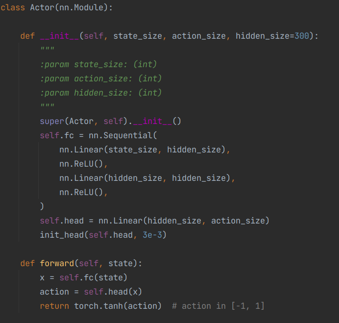
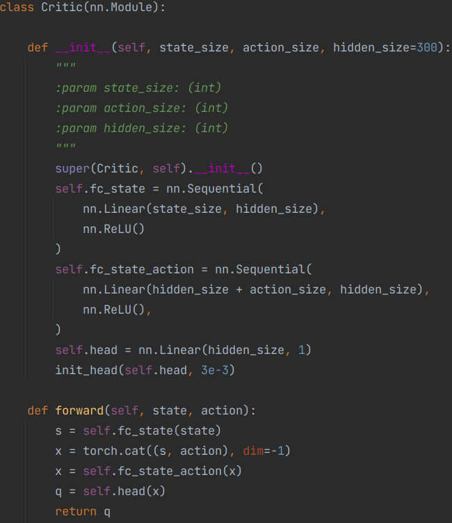
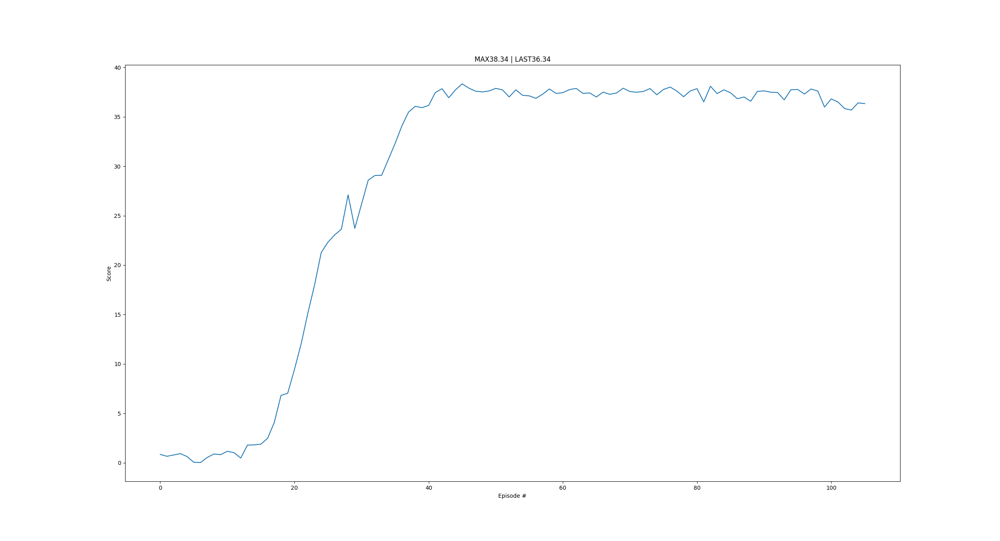

I reached score of ~30 at Reacher task within 106 episodes thus solved the problem, using DDPG(Deep Deterministic Policy Gradient). 

## Learning Algorithm

I used Deep Deterministic Policy Gradient algorithm(https://arxiv.org/pdf/1509.02971.pdf).

### NN architecture

For actor network architecture, I used

For critic network architecture, I used

### Hyperparameters
* actor_lr: 1e-3 (learning rate for updating local actor network)
* critic_lr: 1e-3 (learning rate for updating local critic network)
* gamma: 0.99 (discount factor when calculating return)
* tau: 1e-3 (interpolation rate for updating target networks)
* buffer_size: 1e6 (maximum number of experiences to save in replay buffer)
* batch_size: 1024 (number of experiences to do one step of update)

## Plot of Scores While Training
This plot shows average scores in past 100 episodes per episode.

## Test Performance
3 episodes avg: 38.3

## Ideas for Future Work
* Tune hyperparameters
* Use different noise generator / gradually decay noise
* Try other rl algorithms for continuous action space e.g. PPO, A2C
